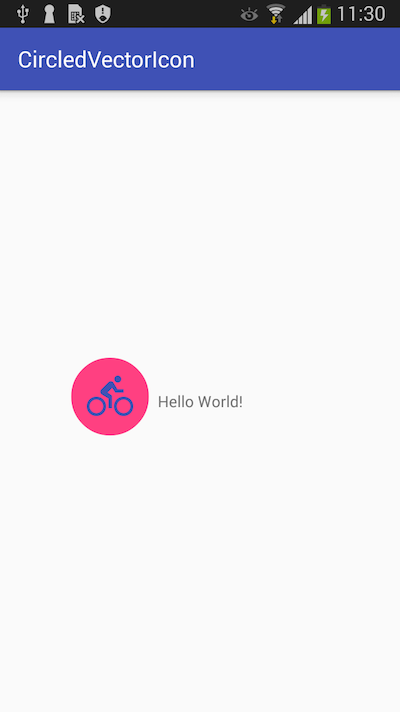

[](https://jitpack.io/#meierjan/CircledVectorIcon)

# CircledVectorIcon
A basic library that enables you to add circled vector icons to your views. This is a proof of concept and will be refactored later.

The icon-color, circle-color and the icon itself can be specified via xml. Additionally you can specify how much padding (in percent) the image should have in relation to the circle.
```xml
   <wtf.meier.circledvectoricon.CircledVectorIcon
        android:layout_width="70dp"
        android:layout_height="70dp"
        app:drawable="@drawable/icon_bike"
        app:drawableColor="@color/colorPrimary"
        app:circleColor="@color/colorAccent"
        app:imagePaddingPercentage="0.2"
        />
```

Programmatic changes are possible using the fluent-api.
```java
    // example
    circledVectorIconInstance
       .setImageSidePaddingInPercent(.2f)
       .setVectorDrawable(R.drawable.circle_white)
       .setCircleColor(R.color.colorPrimary);
```

# Installation
Add it in your root build.gradle at the end of repositories:
```gradle
    allprojects {
        repositories {
            ...
            maven { url 'https://jitpack.io' }
        }
    }
```
Step 2. Add the dependency
```gradle
    dependencies {
        compile 'com.github.meierjan:CircledVectorIcon:0.2.4'
    }
```

Make sure you add this to your `android > defaultConfig` in the app folder (not project).
```gradle
    vectorDrawables.useSupportLibrary = true
```


# Compatibility
This library is tested on a _Samsung Galaxy S II mini_ (Android 4.1.2), a _Samsung Galaxy S III_ (Android 4.3) and a _Nexus 5X_ (7.1).

# Screenshot
This is a screenshot of the example.


