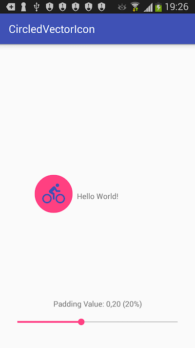

[](https://jitpack.io/#meierjan/CircledVectorIcon)

# CircledVectorIcon
A basic library that enables you to add circled vector icons to your views. This is a proof of concept and will be refactored later.

The icon-color, circle color and the icon itself can be specified via xml.
```
   <wtf.meier.circledvectoricon.CircledVectorIcon
        android:layout_width="70dp"
        android:layout_height="70dp"
        [...]
        app:drawable="@drawable/icon_bike"
        app:drawableColor="@color/colorPrimary"
        app:circleColor="@color/colorAccent"
        />
```
Add it in your root build.gradle at the end of repositories:
```
    allprojects {
        repositories {
            ...
            maven { url 'https://jitpack.io' }
        }
    }
```
Step 2. Add the dependency
```
    dependencies {
        compile 'com.github.meierjan:CircledVectorIcon:0.1'
    }
```
# Installation
Make sure you add this to your `android > defaultConfig` in the app folder (not project).
```
vectorDrawables.useSupportLibrary = true
```


# Compatibility
This library is tested on a Samsung Galaxy S III (Android 4.3) and a Nexus 5X (7.1).

# Screenshot
This is a screenshot of the example.


